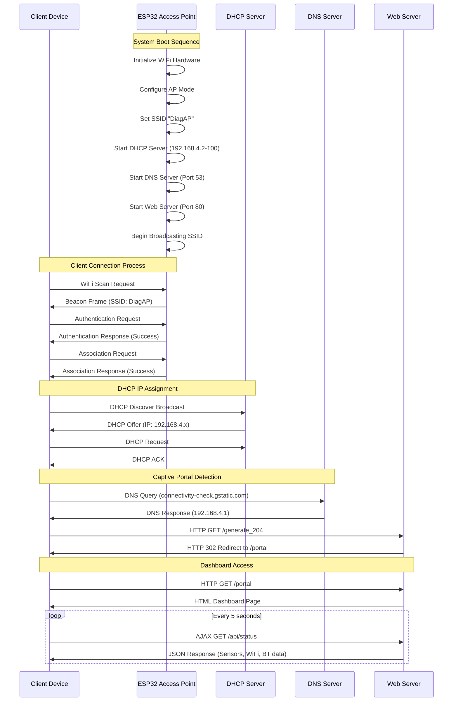
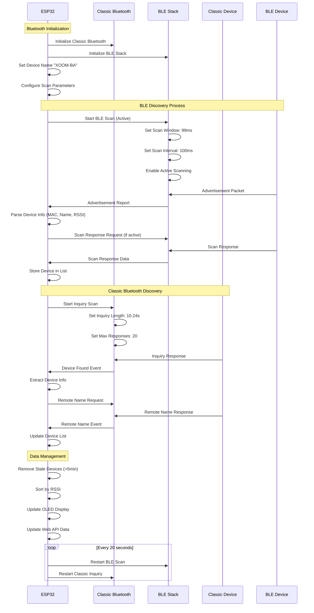
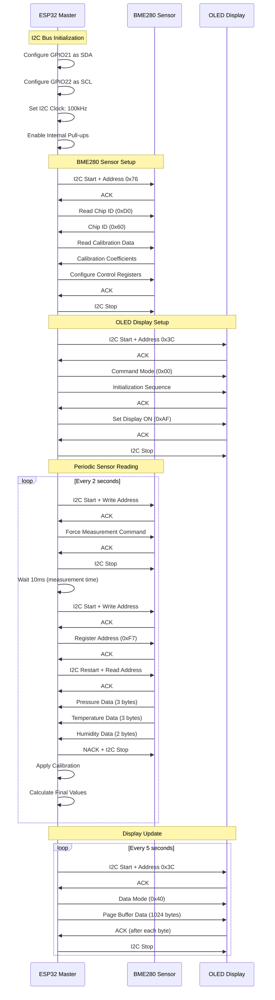
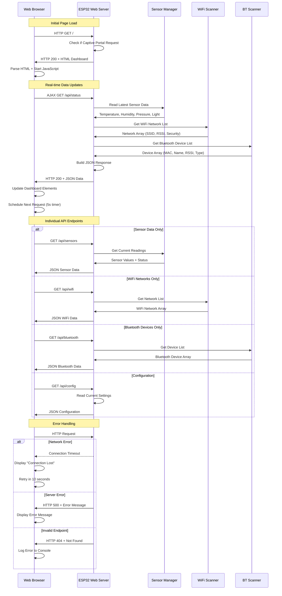

# XOOM-BA Communication Protocols

## WiFi Access Point Handshake



## Bluetooth Discovery Protocol



## I2C Sensor Communication



## Web API Protocol



## System State Machine

```mermaid
stateDiagram-v2
    [*] --> Boot
    Boot --> Initializing
    Initializing --> Hardware_Check
    Hardware_Check --> Network_Setup
    Network_Setup --> Running
    
    state Hardware_Check {
        [*] --> Check_OLED
        Check_OLED --> Check_DHT22
        Check_DHT22 --> Check_BME280
        Check_BME280 --> Check_LDR
        Check_LDR --> [*]
    }
    
    state Network_Setup {
        [*] --> Start_AP
        Start_AP --> Start_DHCP
        Start_DHCP --> Start_DNS
        Start_DNS --> Start_WebServer
        Start_WebServer --> Start_Bluetooth
        Start_Bluetooth --> [*]
    }
    
    state Running {
        [*] --> Sensor_Update
        Sensor_Update --> WiFi_Scan
        WiFi_Scan --> BT_Scan
        BT_Scan --> Display_Update
        Display_Update --> Web_Handler
        Web_Handler --> Sensor_Update
        
        Sensor_Update --> Error_State : Sensor Failure
        WiFi_Scan --> Error_State : WiFi Error
        BT_Scan --> Error_State : Bluetooth Error
    }
    
    Error_State --> Recovery_Attempt
    Recovery_Attempt --> Running : Success
    Recovery_Attempt --> Restart : Failed
    Restart --> Boot
    
    Running --> Sleep_Mode : Low Power Request
    Sleep_Mode --> Running : Wake Event