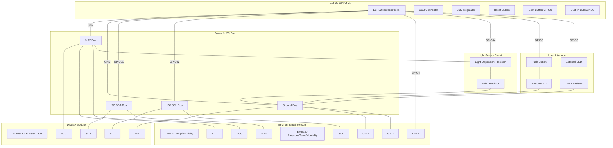
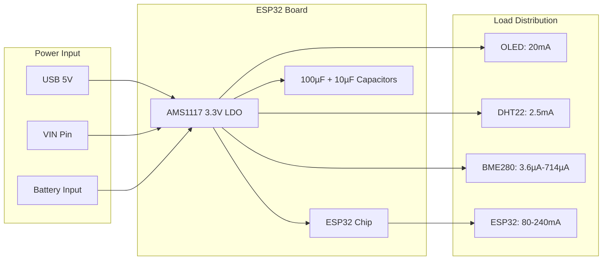
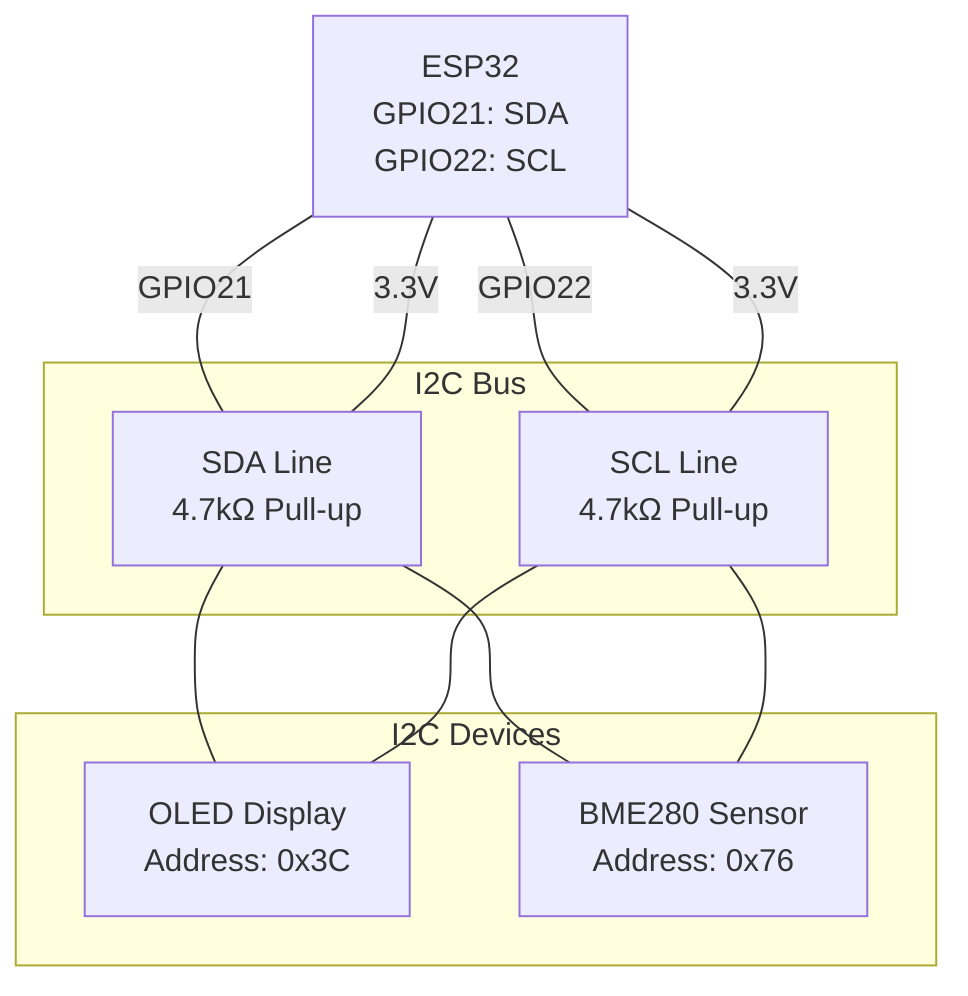
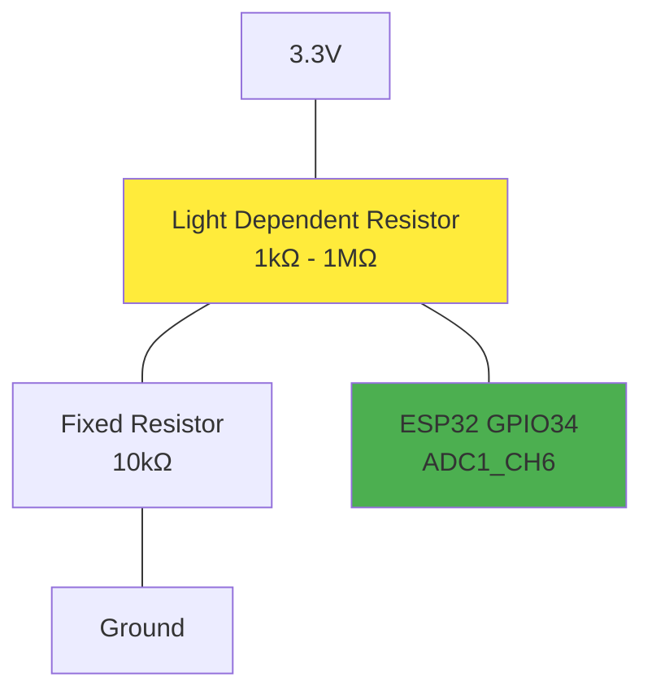
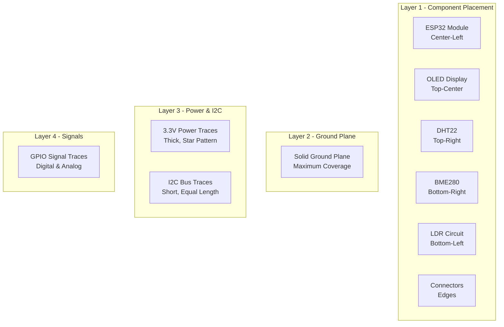

# XOOM-BA Circuit Schematics

## Complete System Schematic

## Power Distribution Schematic

## I2C Bus Topology

## Analog Input Circuit

## PCB Layout Recommendations

## Component Values and Specifications

| Component | Value/Part Number | Tolerance | Package | Notes |
|-----------|------------------|-----------|---------|-------|
| R1 (LDR Pulldown) | 10kΩ | ±5% | 0805 | Metal film preferred |
| R2 (LED Current) | 220Ω | ±5% | 0805 | For 3.3V operation |
| C1 (Power Bypass) | 100µF | ±20% | Electrolytic | Tantalum alternative |
| C2 (High Freq Bypass) | 10µF | ±10% | Ceramic | X7R dielectric |
| C3 (I2C Decoupling) | 100nF | ±10% | Ceramic | Near each I2C device |
| LDR | GL5528 | - | Through-hole | 5-10kΩ @ 10 lux |
| Button | Tactile Switch | - | 6x6mm | 50mA, 12V rated |

## Assembly Notes

1. **Soldering Order**: Start with smallest components first
2. **I2C Bus**: Keep traces short and equal length
3. **Power Decoupling**: Place bypass capacitors close to power pins
4. **Ground Plane**: Ensure solid ground connections
5. **Testing Points**: Add test points for key signals
6. **Mechanical**: Consider mounting holes and enclosure compatibility